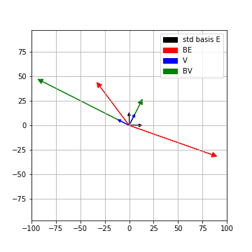

<!-- 
======================================================================
                         QUARTO CHEAT SHEET
======================================================================
THEOREM CALLOUT:
::: {.callout-note icon=false collapse="true"}
## Theorem (Title)
$$ equation $$
:::

PYTHON CODEBLOCK:
```python
def f(x):
  return x+3
```

WARNING
::: {.callout-important icon=false}
## Warning
Danger!
:::

FOOTNOTES USAGE 1
When we see X[^def-X], we think that we might have seen X[^def-X] before

[^def-X] Definition of X


FOOTNOTES USAGE 2
When we see X^[footnote on X]

OTHER QUICK TEMPLATES:
- Cross-Ref Image:  {#fig-label width=50%}
- Cross-Ref Table:  | Col 1 | Col 2 | {#tbl-label}
- Highlight Box:    ::: {.callout-important} \n Danger! \n :::

Reference the figure by @fig-label

TYPOGRAPHY: 
Lists:

* `inline code`
* **bold**
* *italic*,

======================================================================
-->

## Prerequisites
We'll assume you that you have read [this introductory post](2020-07-27-SVD.qmd) on singular value decomposition a.k.a SVD.

## The theorem 

In this post, we'll get our hands dirty and examine how and why SVD works. But let's first recall what it is.

::: {.callout-note icon=false}
## Theorem : SVD
Let $A$ be an $n \times m$ real matrix. Then $A = U\Sigma V^T$ where:

 * $U$ is an $n \times n$ *orthogonal*[^def-orthogonal-matrix] matrix
 * $V$ is an $m \times m$ orthogonal matrix
 * $\Sigma$ is an $n\times m$ matrix where every entry except the first $r$ diagonal entries is zero where $r$ is the rank of $A$
 * Further the non-zero diagonal entries of $\Sigma$ are precisely the so-called *singular values*[^def-singular-values] of $A$ arranged in descending order.
:::

We saw in the introductory post that the columns of $V$ (let's call them $v_1, v_2, \ldots v_m$) are mutually perpendicular unit vectors which form a basis of $\mathbb{R}^m$ (a.k.a an *orthonormal basis* of $\mathbb{R}^m$). 


Further $\{A(v_i)\}$ still remain perpendicular to each other in $\mathbb{R}^n$. The length of the vectors $\{A(v_i)\}$ are encoded by the diagonal entries of $\Sigma$. The unit vectors along $\{A(v_i)\}$ can be completed to an orthonormal basis of $\mathbb{R}^n$, which are precisely given by the columns of $U$. 

## A blackbox
Before jumping to the proof, let's reveal our secret weapon, the _spectral theorem_. This theorem, applied to real matrices states the following:

::: {.callout-note icon=false}
## Spectral theorem
Let $B$ be an $m\times m$ real and symmetric matrix. Then there exists an orthonormal eigenbasis for $B$. 
:::

Wait, what ? Let's unravel that sentence again and take the result in, bit by bit. 

You give me any real square matrix $B$ such that it is symmetric, i.e. $B_{i,j} = B_{j,i}$. We know that $B$ is really representing a linear map $Q: \mathbb{R}^m \to \mathbb{R}^m$ with respect to the standard basis. But the images of the standard basis under $Q$ of course might get distorted. So the images might no longer remain perpendicular to each other, much less continue being the standard basis.

The spectral theorem assures us however that if $B$ is symmetric, there is a much _nicer_ basis available, an *orthonormal* basis of $\mathbb{R}^m$ in fact, which $Q$ simply scales to different lengths!

More precisely, we can find unit mutually perpendicular vectors $w_1, w_2, \ldots, w_m$ so that $Q(w_i) = \lambda_i w_i$ for some scalars $\lambda_i$. Of course these scalars are by definition the *eigen-values* of $Q$, or equivalently of $B$.


## A running example and a proof

> _If only I had the theorems! Then I should find the proofs easily enough_ - Riemann"


Remember $A$, our very down to earth $2 \times 2$ matrix from last time

$$
A  =  \left( \begin{array}{cc}
      6 & 2  \\
      -7 & 6 
    \end{array} \right)
$$


Now unfortunately, we cannot use the spectral theorem directly on a general $A$ because it is not symmetric. So instead, we first *manufacture* a symmetric matrix $B$ from $A$ by letting $B = A^TA$. In our running example, 

$$
B  = \left( \begin{array}{cc}
      6 & -7 \\
      2 & 6 
    \end{array} \right)   \left( \begin{array}{cc}
      6 & 2  \\
      -7 & 6 
    \end{array} \right) = \left( \begin{array}{cc}
       85 & -30  \\
      -30 & 40
    \end{array} \right)
$$


Spectral theorem applied to $B$ guarantees that there are two perpendicular unit vectors which are simply scaled by the action of $B$. We'll not get into *how* you can find these vectors but wave the spectral theorem wand and give them to you.

$$
\begin{align*}
v_1 = \left( \begin{array}{c}
      \frac{-2}{\sqrt{5}} \\
      \frac{1}{\sqrt{5}}
      \end{array} \right) \  & \mathrm{ and} \hspace{2mm} Bv_1 = 100 v_1 \\
v_2 = \left( \begin{array}{c}
      \frac{1}{\sqrt{5}} \\
      \frac{2}{\sqrt{5}}
      \end{array} \right) \ & \mathrm{ and} \hspace{2mm}  Bv_2 = 25 v_2
\end{align*}
$$
 

Here's a visualization of the action of $B$ on the standard basis and on $V = (v_1,v_2)$. Both the bases' lengths are scaled up a bit for clarity in the picture




So we have found an orthonormal basis $v_1, v_2$ of $\mathbb{R}^2$, which is *very nice* for $B$. How does $A$ act on it ?


$$ 
\begin{align*}
Av_1 = \left( \begin{array}{c}
      \frac{-10}{\sqrt{5}} \\
      \frac{20}{\sqrt{5}}
      \end{array} \right) \  & \mathrm{ and} \hspace{2mm} \| Av_1 \| = 10\\
Av_2 = \left( \begin{array}{c}
      \frac{10}{\sqrt{5}} \\
      \frac{5}{\sqrt{5}}
      \end{array} \right) \ & \mathrm{ and} \hspace{2mm}  \|Av_2\| = 5\\
\end{align*}
$$


We see that $Av_1$ is  perpendicular to $Av_2$ ! Further the length of $Av_1, Av_2$ are $\sqrt{100} = 10, \sqrt{25} = 5$, which are precisely the singular values of $A$ by definition.


This is not a coincidence. For starters, we know $v_1$ perpendicular to $v_2$, i.e. $v_1^Tv_2 = 0$. Let's see why $Av_1$ is perpendicular to $Av_2$

$$
\begin{align*}
Av_1 \cdot Av_2 &= (Av_1)^T Av_2 = v_1^T A^T A v_2\\
& = v_1^T Bv_2 = v_1^T 25v_2\\ 
& = 25 v_1^Tv_2 = 0\\
\end{align*}
$$


Thus $Av_1, Av_2$ are perpendicular to each other. As an exercise, using the fact that length of a vector $\|x \|= x^T x$, try computing the lengths of $Av_i$. 


More generally, the same reasoning tells us the following:

::: {.callout-note icon=false appearance="simple"}
If $v_1, v_2$ are perpendicular eigenvectors of $B=A^TA$ for eigenvalues $\lambda_1, \lambda_2$, then $Av_1, Av_2$ are still perpendicular and have lengths $\sqrt{\lambda_1}, \sqrt{\lambda_2}$.
:::


Thus, the orthonormal eigenbasis of $B=A^TA$ given by the spectral theorem is exactly $V$ in the SVD of $A = U\Sigma V^T$ !


## Summary


Given an $n\times m$ matrix A, here are the steps to find the SVD of $A$:

* Form the $m \times m$ symmetric matrix $B= A^TA$
* The spectral theorem gives us an orthogonal eigen-basis $v_1,v_2, \ldots, v_m$ for $B$ of $\mathbb{R}^m$ with eigenvalues $\lambda_1 \geq \lambda_2 \geq \ldots \lambda_m$
* $V$ is just the $m\times m$ matrix $\left(\begin{array}{cccc}v_1 & v_2 & \ldots & v_m \end{array}\right)$
* $\Sigma$ is the $n\times m$ matrix where all non-diagonal entries are 0 and $\Sigma_{i,i} = \sqrt{\lambda_i}$
* $AV$ is an $n\times m$ matrix made of mutually perpendicular columns
* Scaling the columns of $AV$ to unit vectors, complete it to an orthonormal basis of $\mathbb{R^n}$. This orthonormal basis gives you the $n\times n$ matrix $U$.
* Finally, 

$$A = U \Sigma V^T $$


For our running example, we see that this corresponds to 


$$ \left( \begin{array}{cc}
      6 & 2  \\
      -7 & 6 
    \end{array} \right)= 
    \left( \begin{array}{cc}
      \frac{-1}{\sqrt{5}}  & \frac{2}{\sqrt{5}} \\
       \frac{2}{\sqrt{5}} & \frac{1}{\sqrt{5}} \\
    \end{array} \right)
  \left( \begin{array}{cc}
      10  &  0 \\
       0 & 5  \\
    \end{array} \right)
  \left( \begin{array}{cc} 
\frac{-2}{\sqrt{5}} & \frac{1}{\sqrt{5}} \\
\frac{1}{\sqrt{5}} &  \frac{2}{\sqrt{5}} \\
\end{array}\right)
$$


[^def-orthogonal-matrix]: A square matrix $X$ is _orthogonal_ iff $X^TX = XX^T$ is the identity matrix.
[^def-singular-values]: The _singular values_ of an $n\times m$ matrix A are the square roots of the eigenvalues of $A^TA$ listed with their algebraic multiplicities.


  
  
  
 


  


