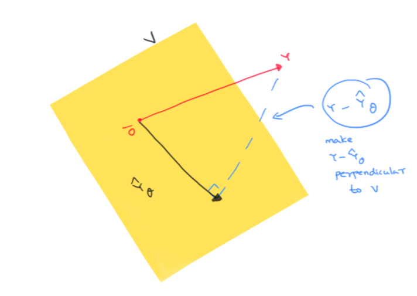

<!-- 
======================================================================
                         QUARTO CHEAT SHEET
======================================================================
THEOREM CALLOUT:
::: {.callout-note icon=false collapse="true"}
## Theorem (Title)
$$ equation $$
:::

PYTHON CODEBLOCK:
```python
def f(x):
  return x+3
```

WARNING
::: {.callout-important icon=false}
## Warning
Danger!
:::

FOOTNOTES USAGE 1
When we see X[^def-X], we think that we might have seen X[^def-X] before

[^def-X] Definition of X


FOOTNOTES USAGE 2
When we see X^[footnote on X]

OTHER QUICK TEMPLATES:
- Cross-Ref Image:  {#fig-label width=50%}
- Cross-Ref Table:  | Col 1 | Col 2 | {#tbl-label}
- Highlight Box:    ::: {.callout-important} \n Danger! \n :::

Reference the figure by @fig-label

TYPOGRAPHY: 
Lists:

* `inline code`
* **bold**
* *italic*,

======================================================================
-->

## Prerequisites
Basic linear algebra, derivatives, orthogonal projections and a will to think abstractly!


## What is linear regression ?

In an experiment, we observe the values of some *features* or *attributes*. We would like to predict the value of a *target* variable based on the observed features. Linear regression tries to guess a linear relationship between the features and the target.

To continue with our weather example from before, say we have access to the average daily temperature $T$, the wind-gut $W$ , and the total minutes of sunshine $S$ per day. These will be our features. We would like to predict the amount of precipitation $P$ each day. This will be our target variable.

We are trying to find a linear relationship between $P, T, W, S$. That is, we'd like to find $\theta_0, \theta_1, \theta_2, \theta_3$ so that 

$$
P = \theta_0 + \theta_1 T + \theta_2 W + \theta_3 S
$$


## Linear regression abstracted out

Let's say we have weather data over $n$ days. For day $i$, we collect that day's feature values $T, W, S$ into a row vector $x_i = (x_i^1, x_i^2, x_i^3)$. That day's precipitation value becomes the target value $y_i$.


Abstracting out this set up, we can assume we are given data points $x_1, x_2, \ldots x_n$ where each data point $x_i$ has $k$ *features* and has target $y_i$. That is, each data point $x_i$ looks like the row vector 
$x_i = (x_i^1, x_i^2, \ldots, x_i^k)$ and the target variable in which we are interested in has value $y_i$ for the data point $x_i$. 


Linear regression tries to find a linear relationship between the data points $x_i$ and their targets $y_i$. That is, we want to find real numbers $\theta_0, \theta_1, \ldots , \theta_k$ so that for each $i$, we have

$$
\theta_0 + \theta_1 x_i^1+ \theta_2 x_i^2 + \ldots + \theta_k x_i^k = y_i
$$


#### Introducing dummies

The $\theta_0$ stands out without a binding feature $x_i^0$, so to make it uniform, we introduce a dummy feature $x_i^0 = 1$ for each datapoint $x_i$. That is, each data point $x_i$ now looks like the row vector 

$$
x_i = (x_i^0=1, x_i^1, x_i^2, \ldots, x_i^k)
$$

So we want to find real numbers $\theta_0, \theta_1, \ldots , \theta_k$ so that for each $i$, we have

$$
\theta_0 x_i^0 + \theta_1 x_i^1+ \theta_2 x_i^2 + \ldots + \theta_k x_i^k = y_i
$$


## A matrix equation

Let's bundle up $\theta_0, \theta_1, \theta_2, \ldots, \theta_k$ into a column vector $\theta$, $y_1, y_2, \ldots, y_n$ into a column vector $Y$ and the row vectors $x_1, x_2, \ldots , x_n$ into a $n\times (k+1)$ matrix $X$


$$
X = \left(\begin{array}{ccccc} x_1^0 & x_1^1 & x_1^2 & \ldots & x_1^k \\ x_2^0 & x_2^1 & x_2^2 & \ldots & x_2^k \\ . & . & . & \ldots & .  \\ x_n^0 & x_n^1 & x_n^2 & \ldots & x_n^k \end{array}\right)\ ; \ \theta = \left(\begin{array}{c} \theta_0 \\ \theta_1 \\ . \\ . \\ \theta_k \end{array}\right) \ ; \ Y = \left(\begin{array}{c} y_1 \\ y_2 \\. \\ y_n \end{array}\right)
$$


Then solving the $n$ linear regression equations above simultaneously is the same as solving the matrix equation $X\theta = Y$

## An approximate solution using least-squares

Unfortunately, you might not always be able to solve this system of linear equations on the nose. Then we aim for an *approximate solution* which is the best among other approximate solutions in the following sense:

Let $X\theta = \hat{Y}_{\theta}$. That is, our predicted values for the target variable is ^[Let $\hat{Y}_{\theta} = \left(\begin{array}{c} \hat{y_1} \\ \hat{y_2} \\. \\ \hat{y_n} \end{array}\right)$] $\hat{Y}_{\theta}$. We would like our predictions to be as close to the real truth as possible. So we want $\hat{Y}_{\theta}$ to be as close to $Y$ as possible. That is, we want the norm $\|Y-\hat{Y}_{\theta}\|$ to be minimal.


Since this is the same as demanding minimality of  $\|Y-\hat{Y}_{\theta}\|^2$, we want to minimize the following sum of squares

$$
(y_1-\hat{y}_1)^2 + (y_2-\hat{y}_2)^2 + \ldots (y_n - \hat{y}_n^2)
$$


That is, we want a *least-squares solution* of the matrix equation $X\theta = Y$

## An analytic approach


*If you are uncomfortable with multivariable derivatives, skip ahead to the geometric approach!*

$$
\begin{align*} \|Y-\hat{Y}_{\theta}\|^2 & = (Y-\hat{Y}_{\theta})^T (Y-\hat{Y}_{\theta}) \\ & = (Y-X\theta)^T(Y-X\theta)\\ & = (\theta^TX^T-Y^T)(Y-X\theta) \\ & = \theta^TX^TY - Y^TY -\theta^TX^TX\theta + Y^TX\theta \\ & = \theta^TX^TY - Y^TY -\theta^TX^TX\theta + (\theta^TX^TY)^T\end{align*}
$$


Since $\theta^TX^TY$ is a^[$\theta^TX^TY$ is an $(1\times (k+1))((k+1)\times n)(n\times 1) = 1\times 1$ matrix] $1\times 1$ matrix, $\theta^TX^TY = (\theta^TX^TY)^T$. Thus 

$$
\|Y-\hat{Y}_{\theta}\|^2 = - Y^TY -\theta^TX^TX\theta + 2\theta^TX^TY
$$. 


Since $Y^TY$ doesn't depend on $\theta$, we may as well minimize the following function 

$$
f(\theta) = 2\theta^TX^TY -\theta^TX^TX\theta
$$


Taking gradient with respect to $\theta$, we get $\nabla_{\theta}f = 2X^TY - 2X^TX\theta$. Remember we want the gradient to be 0 since we are trying to find extrema of $f(\theta)$. So we want $2X^TY - 2X^TX\theta = 0$. 


That is, we  want $\theta$ so that $X^TX\theta = X^TY$. 


## Normal equation

The matrix equation $X^TX\theta=X^TY$ is called the *normal equation* of $X\theta=Y$. And from our discussion above, it should be more or less clear that a solution $\theta$ of the normal equation gives a least-squares solution of $X\theta=Y$.


This is good, but how do we know a solution of the normal equation *actually exists* ? Also how do we check that the extrema we get are actually minima ? These can of course be shown with some further computation. Instead, we present a geometric approach which avoids derivatives altogether and uses some geometric insight to derive the normal equation and show the existence of a least-squares solution!


## A geometric approach


Let's go back to the equation $X\theta = Y$.  Since we can't always solve this equation on the nose, we are content with an approximate solution $\theta$ so that $X\theta \simeq Y$. If we define $\hat{Y}_\theta = X\theta$, then out of all possible approximate solutions $\theta$, we want to pick the one so that $\| Y-\hat{Y}_{\theta}\|$ is minimum.


Let's consider the space of ALL possible values for $\theta$. This is just $\mathbb{R}^{k+1}$, i.e $\theta$ can be any $k+1$ column vector. Let's now look at the set $V$ which consists of all possible predictions $\hat{Y}_{\theta}$. That is, 


$$
V = \{ X\theta \mid \theta \in \mathbb{R}^{k+1}\}
$$


Let's view $X$ as a linear map $X: \mathbb{R}^{k+1}\to \mathbb{R}^n$, that is $X$ is a linear map from the space of possible $\theta$s to the space of all possible values of the target variable.


Then $V$ is just the image of $X$. In particular, it is a subspace of $\mathbb{R}^n$. To reiterate, $\mathbb{R}^n$ is the space of all possible values of the target variable, $Y$ is the particular value of the target variable that we are trying to hit and $V$ is the subspace of all our possible predictions.


Now if $Y$ lies in $V$, we can hit it on the nose, that is we can find a solution $\theta$ that actually solves $X\theta=Y$. If we can't, we are trying to find the vector $\hat{Y}_{\theta}$ in $V$ which is *closest*^[Distance between $\hat{Y}_{\theta}$ and $Y$ is $\|Y-\hat{Y}_{\theta}\|$] to $Y$.


## Finding the vector in a subspace closest to a given target

$V$ is a subspace of $\mathbb{R}^n$ and $Y$ is a given vector in $\mathbb{R}^n$. We want to find $\hat{Y}_{\theta}\in V$ which is closest to $Y$. How do we do that ?
Let's visualize these vectors and also the vector $Y-\hat{Y}_{\theta}$. Remember we are trying to make $\|Y-\hat{Y}_{\theta}\|$ as small as possible





Since the shortest distance between a point and a subspace is the perpendicular from the point to the subspace, we aim to make $Y-\hat{Y}_{\theta}$ to be perpendicular to $V$ ! Note that this is the same thing as saying that the closest prediction $\hat{Y}_{\theta}$ is simply the *orthogonal projection* of $Y$ to $V$.

## Images and kernels and transposes


Now there is a really nice relation^[Consult your favorite Linear Algebra textbook for this fact] between images of a linear map $X$ and the kernel of its transpose $X^T$. Vectors perpendicular to $\mathrm{Image}(X)$ are actually in the kernel of $X^T$ and vice-versa. In symbols, this is written as

$$
\mathrm{Image}(X)^{\perp} = \mathrm{Kernel}(X^T)
$$  


Now we want $Y-\hat{Y}_{\theta}$ to be perpendicular to $V = Image(X)$. So we want $Y-\hat{Y}_{\theta}$ to be in the kernel of $X^T$. That is, we want


$$
\begin{align*} & \phantom{\implies} X^T(Y-\hat{Y}_{\theta}) = 0 \\ & \implies X^T(Y-X\theta) = 0 \\ &\implies X^TX\theta = X^TY \end{align*}
$$


Voila! We want a solution $\theta$ to the normal equation $X^TX\theta = X^TY$

## Solutions of the normal equation

The geometric approach immediately tells you why a solution $\theta$ exists for $X^TX\theta = X^TY$. As we have already figured out, $\theta$ is a solution precisely when $X\theta = \hat{Y}_{\theta}$ is the orthogonal projection of $Y$ onto $V = \mathrm{Image}(X)$. 


So backtracking, take $Y$, project it to $V = \mathrm{Image}(X)$. The projection will have to look like $X\theta$ for some $\theta$ because the projection is *in* the image subspace $V$. That $\theta$ is a solution of the normal equation and hence a least-squares solution to the equation $X\theta=Y$ we are after!


## Uniqueness of the least-squares solution

There is one point that we have glossed over, namely, __is the $\theta$ we are after unique ?__ Using our geometric approach, the projection of $Y$ onto $V$ (which is $\hat{Y}_{\theta}$) is unique. But there could be several $\theta$ such that $X\theta = \hat{Y}_{\theta}$


But further suppose, $X$ is an injective map, i.e. it has zero kernel, then the $\theta$ we get is unique. And actually, *it turns out*^[We can actually show $\mathrm{Kernel}(X)$ is the same as  $\mathrm{Kernel}(X^TX)$. A little thought should convince you that $\mathrm{Kernel}(X)\subseteq \mathrm{Kernel}(X^TX)$. <br><br> For the other way around, take an arbitrary element $a\in \mathrm{Kernel}(X^TX)$. Thus, $X^TXa = 0$. This would mean $Xa\in \mathrm{Kernel}(X^T) = \mathrm{Image}(X)^{\perp}$ by the fact stated in the post. Thus $Xa$ is perpendicular to $\mathrm{Image}(X)$. But $Xa$ is *in* $\mathrm{Image}(X)$. <br><br>How can a vector be in a subspace _and_ be perpendicular to the subspace ? Only if the said vector is 0, is this possible. Thus $Xa=0$ and hence $a\in \mathrm{Kernel}(X)$] that if $X$ is injective, so is $X^TX$. Since $X^TX$ is a square matrix, this means $X^TX$ is invertible. So we can actually solve for $\theta$ as follows:


$$
X^TX\theta = X^TY \implies \theta = (X^TX)^{-1}X^TY
$$


## Summary

* The least-squares solutions $\theta$ of the equation $X\theta = Y$ are the same as the solutions of the *normal equation* $X^TX\theta = X^TY$.
* The normal equation always has at least one solution. And further if $\theta$ is a solution, then $X\theta$, the closest prediction, is just the orthogonal projection of $Y$ to $\mathrm{Image}(X)$.
* There *could* be multiple solutions to the normal equation and hence there could be multiple least-squares solutions. However if $X$ is injective (i.e. has zero kernel), then the solution is unique and given by  $\theta = (X^TX)^{-1}X^TY$
  
  
  
 


  


