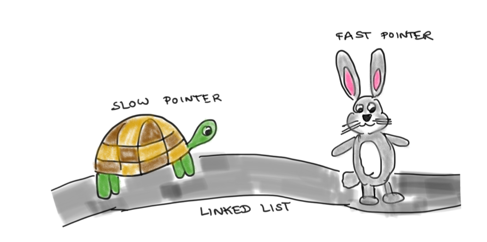
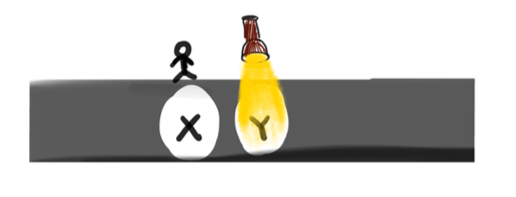
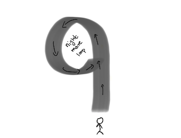

<!-- 
======================================================================
                         QUARTO CHEAT SHEET
======================================================================
THEOREM CALLOUT:
::: {.callout-note icon=false collapse="true"}
## Theorem (Title)
$$ equation $$
:::

PYTHON CODEBLOCK:
```python
def f(x):
  return x+3
```

WARNING
::: {.callout-important icon=false}
## Warning
Danger!
:::

FOOTNOTES USAGE 1
When we see X[^def-X], we think that we might have seen X[^def-X] before

[^def-X] Definition of X


FOOTNOTES USAGE 2
When we see X^[footnote on X]

OTHER QUICK TEMPLATES:
- Cross-Ref Image:  {#fig-label width=50%}
- Cross-Ref Table:  | Col 1 | Col 2 | {#tbl-label}
- Highlight Box:    ::: {.callout-important} \n Danger! \n :::

Reference the figure by @fig-label

TYPOGRAPHY: 
Lists:

* `inline code`
* **bold**
* *italic*,

======================================================================
-->




Linked lists are some of the first data structures we see when we start thinking algorithmically. And a frequently encountered problem on this topic is detecting cycles in linked lists. In this post, let’s go ahead and unravel this problem. But before that ..


## What is a linked list ?

Imagine a narrow tunnel. Each spot in the tunnel leads to exactly one spot ahead. You know the entrance to this tunnel.  Once you step into the tunnel, it is completely dark and you can't see anything else. But there's some hope. If you are in spot X, then a light appears in the spot Y just ahead of you and so you can move to that spot Y now.





The light keeps shining in the step just ahead of you and vanishes from the spot as soon as you reach it. So you can only move ahead step by step (and have no knowledge of what is behind nor what is much further ahead of you)

If the tunnel ends, you can see daylight just ahead. So you will know that the tunnel has ended once you are on the "last step". The tunnel is your *linked list*.


## And what is a cycle ?
Imagine you are in front of such a tunnel. But you are warned that the tunnel might have a *cycle*, i.e the "end of the tunnel" might link back to somewhere in the middle of the tunnel. So there is no actual end to the tunnel in fact. For instance, imagine a tunnel shaped like a nine.




If the tunnel does not have a cycle, it has an actual end point from where you can see daylight and know that you have reached the end. If you end up walking through the tunnel which has a cycle, you'll keep looping around and stuck in the darkness forever not knowing if there is light at the end of the tunnel or if you are stuck in a nightmare loop.


## And what is the problem ?

Your job is to come up with a strategy which allows you to detect if this tunnel in front of you has a cycle or not, i.e. *can you detect if your linked list has a cycle* ? Assume that if you are in the tunnel and you realize the tunnel has a cycle, you can radio an SOS message and someone will come and rescue you.


## A cool strategy !

You invite two adventurous friends of yours over. They are going to be sent into the tunnel armed with radios.  They go into the tunnel at the same time but one of them is going to walk at a slower speed than the other. 


If the tunnel has no cycle, all is well, both friends will exit the tunnel (the faster one will exit sooner of course). 


*What if the tunnel does have a cycle*? Well, the faster one will get trapped in the cycle first. He keeps running around. The slower one will also get trapped in the cycle later. He also keeps running around. But eventually... 


{width=10%}

These two will meet!! Why would they meet ? This seems intuitive enough, but we want a *proof*. A wise friend whispers "Think relative speed .." 


Think from the the point of view of the slower guy. He is stationary with respect to himself and the faster guy is moving with some non zero speed. What happens when you stand still in a circular track while your friend is running around it ? He bumps into you. Voila!


## A summary


So the strategy to detect a cycle in our tunnel aka linked list is - to use two friends equipped with radios (pointers), one slow and one fast to traverse the tunnel. If any one of them  exits the tunnel, they radio you and you know the tunnel has no cycles.  Otherwise if the tunnel does have a cycle, they will meet and will radio you once they have met and you will know that there is indeed a cycle.

Unsurprisingly, one name for this algorithm apparently is the *tortoise and the hare algorithm*


## Let’s code!
Let’s translate our strategy into python code.

```python

class ListNode:
    def __init__(self, x=None):
         self.val = x
         self.next = None


def hasCycle(head: ListNode) -> bool:
    ''' Return True if linked list has a cycle and false otherwise'''
    
    # Base case : If linked list has <= 1 element, no cycle
    if head is None or head.next is None:
        return False

    # Position slow and fast pointers at the start and start+1 position
    slow_pointer = head
    fast_pointer = head.next

    # Traverse linked list while fast_pointer is not at the end of the linked list
    while(fast_pointer is not None):
        # If pointers meet, return True
        if slow_pointer == fast_pointer:
            return True
        # else if the fast pointer is one step before the end of the linked list, return False
        elif fast_pointer.next is None:
            return False
        # otherwise move the fast_pointer ahead by 2 steps and the slow_pointer by one
        else:
            slow_pointer = slow_pointer.next
            fast_pointer = fast_pointer.next.next

    # If the fast_pointer has reached the end of the linked list, return False
    return False

```

 
  


