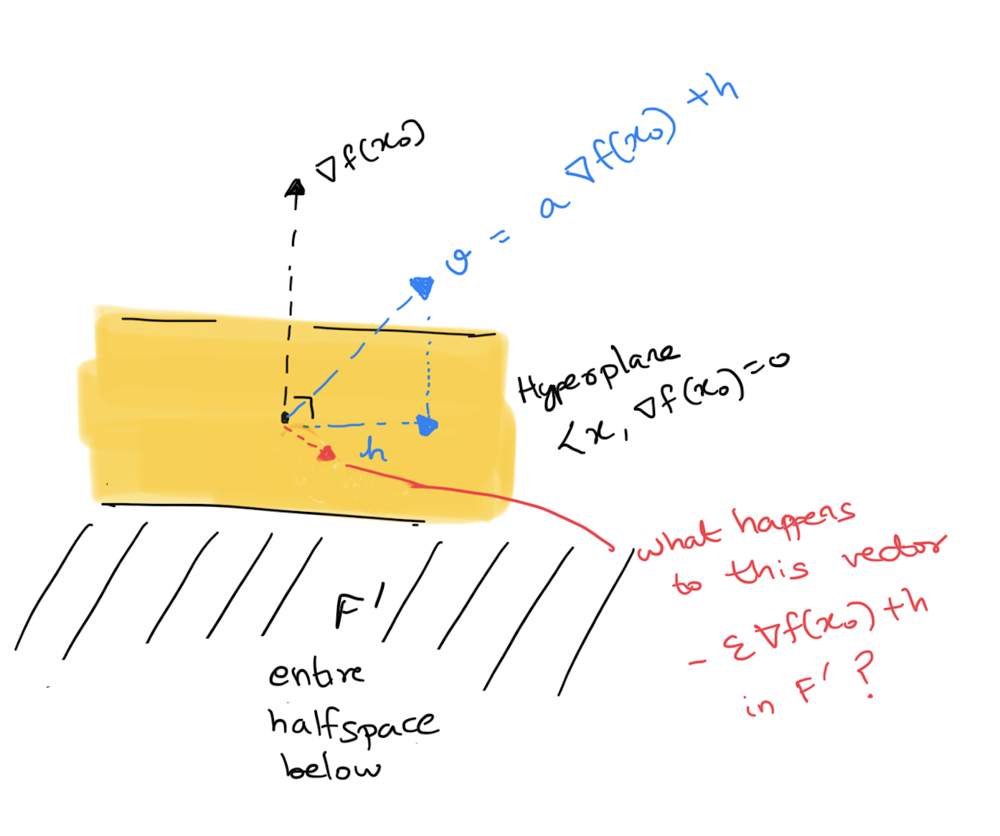
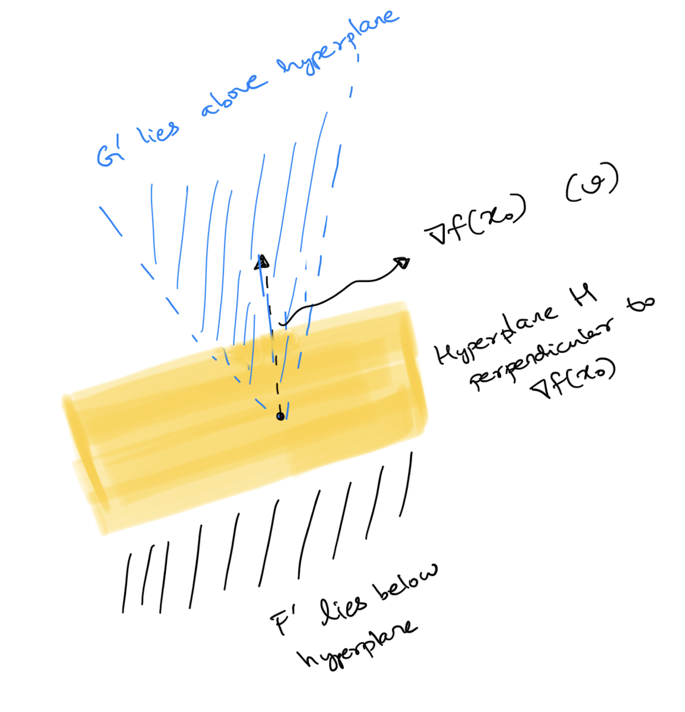

<!-- 
======================================================================
                         QUARTO CHEAT SHEET
======================================================================
THEOREM CALLOUT:
::: {.callout-note icon=false collapse="true"}
## Theorem (Title)
$$ equation $$
:::

PYTHON CODEBLOCK:
```python
def f(x):
  return x+3
```

WARNING
::: {.callout-important icon=false}
## Warning
Danger!
:::

FOOTNOTES USAGE 1
When we see X[^def-X], we think that we might have seen X[^def-X] before

[^def-X] Definition of X


FOOTNOTES USAGE 2
When we see X^[footnote on X]

OTHER QUICK TEMPLATES:
- Cross-Ref Image:  {#fig-label width=50%}
- Cross-Ref Table:  | Col 1 | Col 2 | {#tbl-label}
- Highlight Box:    ::: {.callout-important} \n Danger! \n :::

Reference the figure by @fig-label

TYPOGRAPHY: 
Lists:

* `inline code`
* **bold**
* *italic*,
* _italic_

Lists:

- `inline code`
- **bold**
- *italic*,
- _italic_

======================================================================
-->


*Ref: Foundations of optimization by Bazaraa and Shetty ([link](https://www.springer.com/gp/book/9783540076803)), Chapter 5*

### The optimization problem (A)

Minimize $f(x)$ under the constraints $x\in X$ and $g_i(x) \leq 0$ for $1\leq i\leq m$, where

- $X$ is a subset of $\mathbb{R}^n$
- $f,g_i$ are functions $U\to\mathbb{R}$ for some open set $U\supset X$

### Feasible set, feasible solutions and optimal solutions

- The set of points in $\mathbb{R}^n$ which satisfy the constraints make up the *feasible set* $S$
- Any $x\in S$ is called a *feasible solution* to (A)
- Any $x^*\in S$ such that $f(x^*)$ is minimum among $\{f(x)\mid x\in S\}$ is called an *optimal solution* to (A)


### Rephrasing optimality
In general, one would like to find optimal solutions to (A). Let's rephrase what it means for $x_0\in S$ to be optimal. 

Set $B = B(x_0)=\{x\in S \mid f(x)-f(x_0) < 0\}$. Clearly $x_0$ is optimal exactly when $B=\emptyset$. The idea then is to express $B$ as an intersection $F\cap G\cap X$ where:

- $G=\cap G_i$ where $G_i = \{x \mid g_i(x)\leq 0\}$ captures one portion of the constraints
- $X$ captures the other portion of the constraints
- $F=\{x \mid f(x)<f(x_0)\}$ captures all points which violate optimality of $x_0$

It is an easy check to see indeed that $B=F\cap G\cap X$. Thus $x_0\in S$ is optimal exactly when $F\cap G\cap X$ is empty.


### Necessary conditions for optimality
Since it is in general harder to find optimal solutions, let us focus on *necessary* conditions for optimality instead. Assuming $x_0\in S$ is optimal, can we make some useful statements on $F, G$ and $X$ (apart from the fact that they exist)?


It turns out that we can! The following theorem assures us that we can find convex sets $F', G', X'$ which are non intersecting which further turn out to be, in some sense, *convex approximations* of $F,G,X$ at $x_0$. 
To simplify discussion, let us additionally assume that we pick an optimal $x_0\in S$ which also lies in the *interior*[^def-interior] of $X$. In this case $X'$ is just the full euclidean space and can be taken out of the picture. We then have

::: {.callout-note icon=false}
## Theorem : Non-intersecting convex sets for an optimal point 
Let $x_0\in \mathrm{Interior}(X)$ be an optimal solution for (A). Let $I$ be the set of indices $\{i : g_i(x_0)=0\}$. Assume that $f, g_i,\forall i\in I$ are differentiable at $x_0$ while $g_i, \forall i\not\in I$ are continuous at $x_0$.
Set:

* $X'=\mathbb{R}^n$
* $F' = \{x \mid \langle x, \nabla f(x_0)\rangle < 0\}$^[Intuitively, the gradient $\nabla f(x_0)$ points in the direction of steepest ascent of $f$ at $x_0$. So any $x$ which makes a negative inner product with it is a direction of descent]
* $G'_i = \{x \mid  \langle x, \nabla g_i(x_0)\rangle < 0\}$ for $i\in I$^[Intuitively, since $g_i(x_0)=0$, moving in a direction where $\langle x, \nabla g_i(x_0)\rangle < 0$ ensures the constraint function decreases, keeping it $\leq 0$. If $g_j(x_0)$ is already $<0$, moving a bit will not violate the constraint.]
* $G' = \cap_{i\in I}G'_i$

Then $F'\cap G' (\cap X') = \emptyset$^[Intuitively, the theorem tells us there is no direction in which we can move from $x_0$ which will keep the constraints but minimize $f$ further].
:::

We'll take this theorem for granted and instead, focus on what it gives us.

### Hyperplanes, half-spaces and convex cones

Let us investigate the geometry of $F'$ and $G'$. In particular can we deduce any connections between $\nabla f(x_0)$ and $\nabla g_i(x_0)$s?

The vectors perpendicular to $\nabla f(x_0)$, i.e. $\{x \mid \langle x, \langle x, \nabla f(x_0) = 0\}$ form a *hyperplane* $H$ and $F'$ is just all vectors which lie on side of it.
It is what is called a *half-space*.

Clearly if $v\in F'$, then any positively scaled $\lambda v, \lambda > 0$ also lies in $F'$ (i.e. on the same side of the hyperplane) making $F'$ a *cone*.
As an exercise, check that any positive linear combination of vectors in $F'$ also lie in $F'$, which makes $F'$ a convex cone.

$G'$ is the intersection of such half spaces and also forms a convex cone.


### Hyperplane separation
Since we have these non-intersecting convex sets $F'$ and $G'$, we can invoke the [separation theorem](https://en.wikipedia.org/wiki/Hyperplane_separation_theorem) to get a hyperplane which separates these two.
Further since $F'$ and $G'$ are cones, the hyperplane must pass through the origin, i.e. are just vectors perpendicular to some $v$^[If the hyperplane looks like $\{x \mid \langle x, v \rangle = c\}$ for some $c$, and $F'$ lies on one side of it, so say $\langle f', v\rangle \geq c$ for all $f'\in F'$. You can positively scale $f'$ to make it break this inequality unless $c$ is $0$].

Since $F'$ is the entire halfspace below $\nabla f(x_0)$, we can in fact show that $v$ is just $\nabla f(x_0)$ scaled^[Say $F'$ also lies below the hyperplane $H$ defined by $v$ and $v = a \nabla f(x_0) + h$ where $h\in H$. Since we want $\langle f', v \rangle < 0$ for $f'\in F$, using $\langle f', \nabla f(x_0) \rangle  < 0$ and $\langle f', h \rangle =0$, we have $a >0$. Now construct this problematic vector $-\epsilon \nabla f(x_0) + h$ in $F'$. It needs to lie below the hyperplane perpendicular to $v$ for any $\epsilon > 0$. We can make $\epsilon$ tiny and nudge it above the hyperplane defined by $v$].

{width=50%}

Thus $H$ is indeed the hyperplane separating $F'$ and $G'$ with $G'$ above and $F'$ below. Hence vectors in $G'$ (i.e any $g'$ with $\langle g', \nabla g_i(x_0) \rangle < 0$ for all $i\in I$) have to also satisfy $\langle g', \nabla f(x_0) \rangle > 0$.


{width=50%}

### Hyperplane separation after a linear transformation

Translating back to algebra, this means the equation $Ax < \bar{0}$^[i.e. every coordinate is $<0$] has no solution $x\in \mathbb{R}^n$ where
$$A = \begin{bmatrix}  \nabla f(x_0) \\ \nabla g_{i_1}(x_0) \\ \vdots \\ \nabla g_{i_t}(x_0) \end{bmatrix} \in \mathrm{Mat}_{(|I|+1)\times n}(\mathbb{R})$$

That is, the image^[$\{Ax\mid x\in\mathbb{R}^n\}\subset\mathbb{R}^{|I|+1}$] of $A$ is disjoint from the convex cone $K = \{y \in \mathbb{R}^{|I|+1} \mid y < \bar{0}\}$.
We can once again play our hyperplane separation card and separate these convex sets $\mathrm{Img}(A)$ and $K$ in $\mathbb{R}^{|I|+1}$ by a hyperplane $H' = \{ x \mid \langle x, p \rangle = 0 \}$ for some non-zero vector $p$.


### Reconstructing the Fritz John conditions for optimality 

Without loss of generality, assume $K$ lies "below" the hyperplane, i.e. $\langle k, p \rangle < 0$ for all $k\in K$. Convince yourselves^[Remember $K$ has all the vectors $k<\bar{0}$] that this means $p \geq \bar{0}$.
And further the image of $A$ lies "above" the hyperplane, i.e. $\langle p, Ax \rangle \geq 0$^[The $\geq$ is because the Image of $A$ can cease to be open] for all $x\in \mathbb{R}^n$.

This means $p^TAx = 0$ for all $x$ in $\mathbb{R}^n$, i.e $p^TA$ or equivalently $A^Tp$ is the $0$ vector in $\mathbb{R}^n$ !

$$\begin{bmatrix} \vert & \vert & & \vert \\ \nabla f(x_0) & \nabla g_{i_1}(x_0) & \dots & \nabla g_{i_t}(x_0) \\ \vert & \vert & & \vert \end{bmatrix} \begin{bmatrix} p_0 \\ p_{i_1} \\ \vdots \\ p_{i_t} \end{bmatrix} = \begin{bmatrix} 0 \\ 0 \\ \vdots \\ 0 \end{bmatrix}$$

This gives us,

::: {.callout-note icon=false}
## Fritz John conditions for optimal points
Let $x_0\in \mathrm{Interior}(X)$ be an optimal solution for (A). Let $I$ be the set of indices $\{i : g_i(x_0)=0\}$. Assume that $f, g_i,\forall i\in I$ are differentiable at $x_0$ while $g_i, \forall i\not\in I$ are continuous at $x_0$.
Then there exist non-negative $p_i$ such that:

* Not all $p_0$, $p_i, i\in I$ are zero simultaneously^[simply because $p$ is not the $\bar{0}$ vector].
* $p_0 \nabla f(x_0) + \sum_{i \in I} p_i \nabla g_i(x_0) = 0$
:::

To make this statement read cleaner (i.e get rid of the $I$ set notation in the statement), let us also assume all the $g_j$s are differentiable at $x_0$ and not just $g_i$ for $i\in I$. So $\nabla g_j(x_0)$ exists for all $j$.
Simply set $p_j = 0$ for all $j\not\in I$ to get

::: {.callout-note icon=false}
## Fritz John conditions for optimal points (II)
Let $x_0\in \mathrm{Interior}(X)$ be an optimal solution for (A). Assume that $f, g_j\forall j$ are differentiable at $x_0$.
Then there exist $p_0, p_1, \ldots p_m$ such that:

* $p_j\geq 0$ for all $0\leq j \leq m$
* Not all $p_j$ are zero simultaneously.
* $p_j g_j(x_0) = 0$ (**_complementary slackness_**)
* $p_0 \nabla f(x_0) + \sum_{j=1}^{m} p_j \nabla g_j(x_0) = 0$
:::


Note:

* $p_0$ is called the *Lagrangian multiplier* corresponding to the objective function $f$ and $p_i$, the Lagrangian multiplier corresponding to constraint $g_i$.
* For the constraints, complementary slackness gives us that either the constraint condition $g_i(x_0)$ is $0$ or the corresponding  Lagrangian multiplier $p_i$ is $0$.
* The Fritz John conditions allow $p_0$ to be $0$

### Karush–Kuhn–Tucker conditions (KKT)

The KKT conditions associated to (A) are basically the Fritz John conditions under the additional assumption that $p_0$, the Langrange multiplier of $f$ is non-zero.
More precisely,

::: {.callout-note icon=false}
## KKT 
Let $f, g_i$ be as in problem (A). Let $x^*\in \mathrm{Interior}(X)$ and assume that $f, g_j\forall j$ are differentiable at $x^*$.
We say $x^*$ satisfies the KKT conditions if there exist $p_1, \ldots p_m$ such that:

* *g_j(x^*) \leq 0$ for all $1\leq j \leq m$ (**_primal-feasibility_**)
* $p_j\geq 0$ for all $1\leq j \leq m$ (**_dual-feasibility_**)^[The reason why it is called *dual* feasibility will be a dual story for another time]
* $p_j g_j(x^*) = 0$ (**_complementary slackness_**)
* $\nabla f(x^*) + \sum_{j=1}^{m} p_j \nabla g_j(x^*) = 0$ (**_stationarity_**)
:::

It should be clear that if $x^*$ is indeed an optimal point for (A) *and* $p_0\neq 0$, then it satisfies the KKT conditions.
Conditions which try to force $p_0\neq 0$ for $x^*$ are called *constraint qualifications*, for instance demanding that $\nabla(g_1)(x^*), \ldots, \nabla(g_m)(x^*)$ be linearly independent.
Indeed if this were the case and $x^*$ is optimal, Fritz-John's stationarity equation will force $p_0 \neq 0$.


KKT conditions are already interesting at this point as a test for optimality. Any $x^*$ (with a constrain qualification) which fails to satisfy the KKT conditions will not be optimal.
They are even more useful because under some additional assumptions on $f$, and $g_i$ they can actually guarantee optimality!


[^def-interior]: $x_0$ lies in the interior of $X$ if you can fit an open ball in $\mathbb{R}^n$ around $x_0$ so that the ball also lies inside $X$.