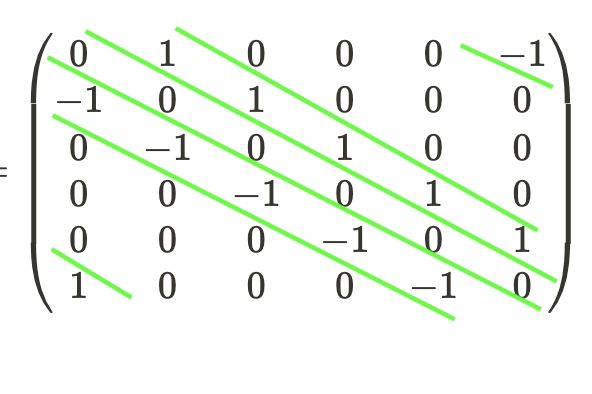

<!-- 
======================================================================
                         QUARTO CHEAT SHEET
======================================================================
THEOREM CALLOUT:
::: {.callout-note icon=false collapse="true"}
## Theorem (Title)
$$ equation $$
:::

PYTHON CODEBLOCK:
```python
def f(x):
  return x+3
```

WARNING
::: {.callout-important icon=false}
## Warning
Danger!
:::

FOOTNOTES USAGE 1
When we see X[^def-X], we think that we might have seen X[^def-X] before

[^def-X] Definition of X


FOOTNOTES USAGE 2
When we see X^[footnote on X]

OTHER QUICK TEMPLATES:
- Cross-Ref Image:  {#fig-label width=50%}
- Cross-Ref Table:  | Col 1 | Col 2 | {#tbl-label}
- Highlight Box:    ::: {.callout-important} \n Danger! \n :::

Reference the figure by @fig-label

TYPOGRAPHY: 
Lists:

* `inline code`
* **bold**
* *italic*,
* _italic_

Lists:

- `inline code`
- **bold**
- *italic*,
- _italic_

======================================================================
-->


*References*:

* _Numpy documentation_: [numpy.convolve.html](https://numpy.org/doc/stable/reference/generated/numpy.convolve.html)
* _Video lecture_: [Dr Hamprecht, Lecture 1.2 CVF20, Heidelberg University](https://www.youtube.com/watch?v=Al-TsPNXXwg)

## Theory: Convolving sequences

Let $f$ and $g$ be infinite sequences. Then the convolution $f\star g$ is an infinite sequence with 

$$
f\star g(i) = \sum_{j=-\infty}^{\infty}f(j)g(i-j)
$$

## In practice: Finite filters and signals

The basic idea is to superimpose the (flipped) filter on part of the signal and calculate the dot product of the two aligned bits, then move the filter ahead and repeat.

More formally, 

- Let $f = [f_0, f_1, \ldots, f_{m-1}]$ be the *filter* or *kernel* or *window* which is an $m\times 1$ vector^[For simplicity in writing down the convolution equations, let us assume $m=2m'+1$ is odd.]
- Let $g = [g_0, g_1, \ldots, g_{n-1}]$ be the *signal* or *image* which is an $n\times 1$ vector

One way of convolution is to make the convolved image or signal  $f\star g$ also be an $n\times 1$ vector. To find the $i^{th}$ value of the convolved signal, i.e. $f\star g(i)$:

- Flip the kernel $[f_{m-1}, f_{m-2}, \ldots, f_{1}, f_{0}]$ → $[f_{m-1}=(f_{2m'}), f_{2m'-1}, \ldots, f_{1}, f_0]$
- Line the flipped kernel  against the signal $g$ so that the center $f_{m'}$ is aligned with $g_i$

$$
\begin{matrix} g_0 & g_1 & \ldots  & g_{i-m’} & g_{i-(m’-1)} & \ldots & g_{i-1} & g_i & g_{i+1} & \ldots & g_{i+(m'-1)} & g_{i+m’} & g_{i+(m’+1)} & \ldots \\
& & & f_{2m'} & f_{2m'-1} & \ldots & f_{m'+1} & f_{m'} & f_{m'-1} & \ldots & f_{1} & f_{0}\end{matrix}
$$

- Take the dot product of the flipped kernel and the portion of the signal it aligns with


Thus for $i=0, \ldots, n-1$

$$
f\star g(i) = \sum_{j=0}^{2m’} f(j)g(i+m’-j) = \sum_{j=0}^{m-1} f(j)g(i-j+\lfloor{m/2}\rfloor)
$$
    
## Padding

What happens for $i$ near the edges of the signal $g$, where you can’t really fit the filter so that its center is aligned with $g(i)$ ? 
    
We can pad the ends of the signal with constant values! 

One option is to pad the either end of the signal with constant $c$ (zero/non-zero value)
            
$$
\begin{matrix} c & c & \ldots & c & g_0 & g_1 & \ldots & g_{m'} & \ldots & g_{n-2} & g_{n-1} \\
f_{2m'} & f_{2m'-1} & \ldots & f_{m'+1} & f_{m’} & f_{m’-1} & \ldots & f_0 & & & & & \end{matrix}
$$


Another option is to wrap around the filter (see below on how to compute $f\star g(0)$ for instance) - provided the filter length is at most the signal length
            
$$
\begin{matrix} g_0 & g_1 & \ldots & g_{m'} & \ldots & g_{n-m'} & \ldots & g_{n-2} & g_{n-1} \\
f_{m’} & f_{m’-1} & \ldots & f_0 & \ldots & f_{2m'} & \ldots &f_{m’+2}& f_{m’+1}\end{matrix}
$$
            
Equivalently, think of $g$ as a repeating signal to impute the $g(k)$ values in the formula above for $k$ outside $[0,n-1]$
            
$$
\begin{matrix} \ldots & g_{n-m'} & g_{n-(m'-1)} & \ldots & g_{n-1} & g_0 & g_1 & \ldots & g_{m'} & \ldots & g_{n-2} & g_{n-1} \\
&  f_{2m'} & f_{2m'-1} & \ldots & f_{m'+1} & f_{m’} & f_{m’-1} & \ldots & f_0 & & & & & \end{matrix}
$$
            
The repeating signal makes the convolution work even when the filter length is larger than the original signal length.

## An example

- Let $f = [1, 0, -1]$
- Let $g = [g_0, g_1, g_2, g_2, g_4, g_5]$


Let’s go with the wrapping around approach to compute the convolved signal at the edges.
    
$$
f\star g(0) \rightarrow \begin{matrix} g_0 & g_1 & g_2 & g_3 & g_4 & g_5 \\ 0 & 1 &  & & & -1 \end{matrix}
$$
    
$$
f\star g(1) \rightarrow \begin{matrix} g_0 & g_1 & g_2 & g_3 & g_4 & g_5 \\ -1 & 0 & 1 & & & \end{matrix}
$$
    
$$
f\star g(2) \rightarrow \begin{matrix} g_0 & g_1 & g_2 & g_3 & g_4 & g_5 \\ & -1 & 0 & 1 & & \end{matrix}
$$
    
$$
f\star g(3) \rightarrow \begin{matrix} g_0 & g_1 & g_2 & g_3 & g_4 & g_5 \\  &  & -1 & 0 & 1 & \end{matrix}
$$
    
$$
f\star g(4) \rightarrow \begin{matrix} g_0 & g_1 & g_2 & g_3 & g_4 & g_5 \\  &  &  & -1 & 0 &  1\end{matrix}
$$
    
$$
f\star g(5) \rightarrow \begin{matrix} g_0 & g_1 & g_2 & g_2 & g_4 & g_5 \\ 1 & &  & & -1 & 0\end{matrix}
$$
    
$$
f\star g = [g_1-g_5, g_2-g_0, g_3-g_1, g_4-g_2, g_5-g_3, g_0-g_4]
$$

## Trivia:  The Toeplitz matrix

- We can combine the above convolution into a matrix product as follows

$$
f\star g = \left( \begin{matrix}0 & 1 & 0 & 0 & 0 & -1 \\
-1 & 0 & 1 & 0 & 0 & 0 \\
0 & -1 & 0 & 1 & 0 & 0 \\
0 & 0 & -1 & 0 & 1 & 0 \\
0 & 0 & 0 & -1 & 0 & 1 \\
1 & 0 & 0 & 0 & -1 & 0 \\
\end{matrix}\right) \left(\begin{matrix}g_0 \\ g_1 \\ g_2 \\g_3 \\g_4 \\ g_5 \end{matrix}\right)
$$

- The matrix constructed is an example of a [***Toeplitz matrix***](https://en.wikipedia.org/wiki/Toeplitz_matrix) or a ***diagonal-constant matrix*** where the diagonals are constant

{width=30%}

## Code

Use `np.convolve(signal, filter, mode)` where mode = `valid`, `same` or `full`

If the filter length is greater than signal length signal, the command `np.convolve(signal, filter, mode)`  simply computes `np.convolve(filter,signal, mode)`. Hence `np.convolve(g,f,mode) = np.convolve(f,g,mode)`.

Hence let us assume without loss of generality that filter length is atmost the signal length.

#### `valid` mode 

```python
# Valid mode only computes dot product where flipped filter sits completely inside signal
# Thus output array length is len(signal) - len(filter) + 1

import numpy as np
f = [1,0,-1] #filter
g = [0,1,2,3,4,5] #signal

#  0 1 2 3 4 5
# -1 0 1

#  0 1 2 3 4 5
#   -1 0 1

#  0 1 2 3 4 5
#     -1 0 1

#  0 1 2 3 4 5
#       -1 0 1

np.convolve(g,f,"valid") 
# Output = array([2, 2, 2, 2])
```

#### `same` mode

```python
# Same mode pads signal ends with 0s and computes dot product where you align 
# flipped filter's center with each signal value
# Thus output array length is len(signal)

import numpy as np
f = [1,0,-1] #filter
g = [0,1,2,3,4,5] #signal

#    0 1 2 3 4 5
# -1 0 1

#  0 1 2 3 4 5
# -1 0 1

#  0 1 2 3 4 5
#   -1 0 1

#  0 1 2 3 4 5
#     -1 0 1

#  0 1 2 3 4 5
#       -1 0 1

#  0 1 2 3 4 5
#         -1 0 1

np.convolve(g,f,"same") 
# Output = array([1, 2, 2, 2, 2, -4])
```

#### `full` mode

```python
# Full mode pads signal ends with 0s and computes dot product where you align
# flipped filter (in all possible overlaps) with the signal
# Thus output array length is len(signal) + len(filter) - 1

import numpy as np
f = [1,0,-1] #filter
g = [0,1,2,3,4,5] #signal

#      0 1 2 3 4 5
# -1 0 1

#    0 1 2 3 4 5
# -1 0 1

#  0 1 2 3 4 5
# -1 0 1

#  0 1 2 3 4 5
#   -1 0 1

#  0 1 2 3 4 5
#     -1 0 1

#  0 1 2 3 4 5
#       -1 0 1

#  0 1 2 3 4 5
#          -1 0 1

#  0 1 2 3 4 5
#            -1 0 1

np.convolve(g,f,"full") 
# Output = array([ 0,  1,  2,  2,  2,  2, -4, -5])
```