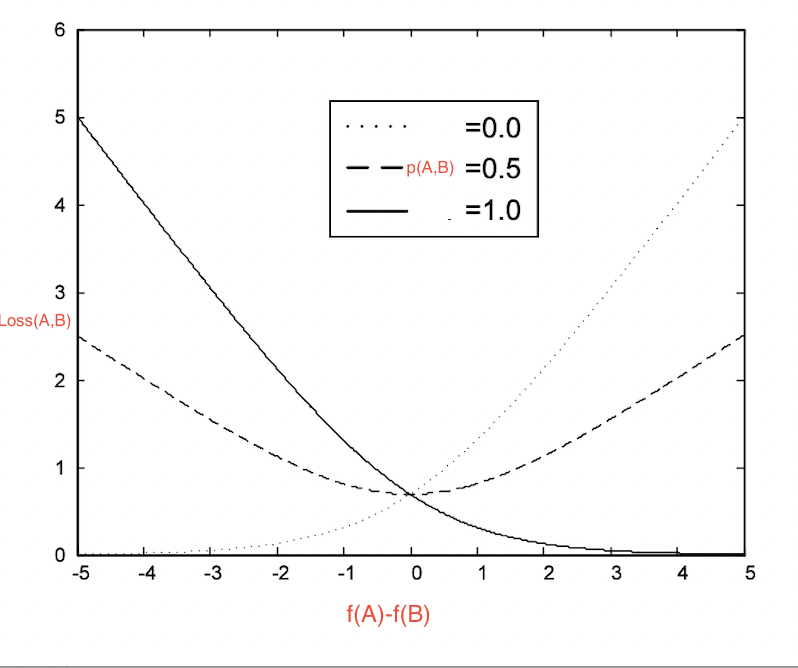
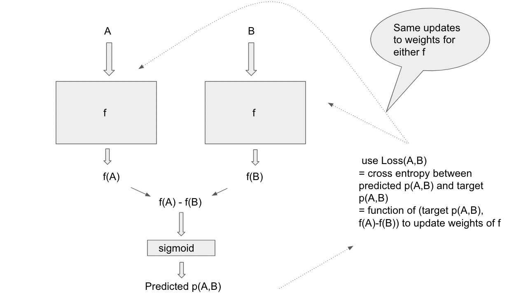

<!-- 
======================================================================
                         QUARTO CHEAT SHEET
======================================================================
THEOREM CALLOUT:
::: {.callout-note icon=false collapse="true"}
## Theorem (Title)
$$ equation $$
:::

PYTHON CODEBLOCK:
```python
def f(x):
  return x+3
```

WARNING
::: {.callout-important icon=false}
## Warning
Danger!
:::

FOOTNOTES USAGE 1
When we see X[^def-X], we think that we might have seen X[^def-X] before

[^def-X] Definition of X


FOOTNOTES USAGE 2
When we see X^[footnote on X]

OTHER QUICK TEMPLATES:
- Cross-Ref Image:  {#fig-label width=50%}
- Cross-Ref Table:  | Col 1 | Col 2 | {#tbl-label}
- Highlight Box:    ::: {.callout-important} \n Danger! \n :::

Reference the figure by @fig-label

TYPOGRAPHY: 
Lists:

* `inline code`
* **bold**
* *italic*,
* _italic_

Lists:

- `inline code`
- **bold**
- *italic*,
- _italic_

======================================================================
-->


*References*:

- *(Main paper) From RankNet to LambdaRank to LambdaMART: an overview by Chris Burges* [(link)](https://www.microsoft.com/en-us/research/wp-content/uploads/2016/02/MSR-TR-2010-82.pdf)
- *Learning to Rank using Gradient Descent : RankNet by Chris Burges et al* [(link)](https://icml.cc/2015/wp-content/uploads/2015/06/icml_ranking.pdf)

## Overview

The main paper talks about 3 algorithms in the  Learning to rank a.k.a LTR class of algorithms,

- RankNet
- Lambda rank
- LambdaMART (boosted tree version of Lambda rank)

which were developed by Christopher J.C Burges et al.

We'll do a deep dive into the RankNet portion of it. RankNet is a supervised learning method to rank a collection of given responses to a query.

Why read this paper ? It is a self contained single exposition on successful algorithms for solving real world ranking problems (which were originally spread across multiple papers). 
Some of these algorithms can also be modified to use for more supervised learning tasks


## The training data

Each data point looks like a pair $(A, B)$ where $A, B$ are responses to the *same* query. The paper implicitly seems to assume all responses $A, B$ are represented in $\mathbb{R}^n$.

(**system $P$**) One way of labelling $(A, B)$ would be:

- $1$ if $A$ has to be ranked higher than $B$, $0$ if $B$ has to be ranked higher than $A$, and $0.5$ if $B, A$ have equal rank (or no info is available)
- In this case the label should be interpreted as the probability that $A$ has to be ranked higher than $B$

(**system $P'$**) Another way of labelling $(A, B)$ would be:

- $1$ if $A$ has to be ranked higher than $B$, $-1$ if *B* has to be ranked higher than $A$, and $0$ if $B, A$ have equal rank (or no info is available)
- In this case $(1+ label)/2$ should be interpreted as the probability that $A$ has to be ranked higher than $B$


**Discussion points**:

- Any example pair $(A, B)$ should satisfy that they are both responses to the same query. Can we have in the training data $(A, B)$ which are responses to query $q$ and $(A’, B’)$ which are responses to query $q’$ ? I think so.
- No necessity that the training data examples specify a complete ranking of responses to a query. Authors don’t even insist that the training data be consistent
- Model will learn score function $f: \mathbb{R}^n→\mathbb{R}$
- Interpretation of score function: If $f(A) > f(B)$ , then model thinks response $A$ should be ranked higher than response $B$

## Loss functions

::: {.callout-note icon=false}
## Loss function for label system $P$^[i.e. where labels for $A > B$ is $1$, $A = B$ is $0.5$ and $B > A$ is $0$ ]
$$
Loss(A, B, \mathrm{Label(A,B)}) = \ln(e^{\lambda(f(A)-f(B))}+1) - \lambda(f(A)-f(B))\mathrm{Label}(A,B)
$$
:::


::: {.callout-note icon=false}
## Loss function for label system $P'$^[i.e. where labels for $A > B$ is $1$, $A = B$ is $0$ and $B > A$ is $-1$ ]
$$
Loss(A, B, \mathrm{Label(A,B)}) = \ln(e^{-\lambda(f(A)-f(B))}+1) + \frac{\lambda}{2} (f(A)-f(B))(1-\mathrm{Label}(A,B))
$$
:::

            
Let us see why. Assume the system $P$ of labelling.

Recall that to turn a score into a probability, we can use the sigmoid function $S_{\lambda}(x) = \frac{1}{1+e^{-\lambda x}}$ where $\lambda > 0$
                
](../assets/2023-10-10-sigmoid.png){width=50%}

Then $x >> 0 \implies S(x) \sim 1$ and $x << 0 \implies S(x) \sim 0$. For us, if $f(A) >> f(B)$, i.e. $f(A) − f(B) >> 0$, we want the probability that $A$ is ranked higher than $B$ to be close to $1$.

#### Deriving the loss function

Let us put all this together!

Define the estimated probability that $A$ has to be ranked higher than $B$ to be $\tilde{p}(A,B)$. $\tilde{p}$ is what the model really has to learn, when it is given training data with the true probabilities a.k.a labels
In other words $\tilde{p}(A, B)$ is the probability that the model will predict label $1$ and $1 − \tilde{p}(A, B)$ is the probability that the model will predict $0$. The loss function therefore is just binary cross entropy. If that doesn't mean
much, let us just walk through it from scratch.


Given example $(A, B)$ with label $p(A, B)$, we want to increase the probability that the model predicts $p(A, B)$ [maximum likelihood principle]. That is we want to

- Maximize $\tilde{p}(A, B)$ if $p(A, B)$ is $1$ and $1 − \tilde{p}(A, B)$ if $p(A, B)$ is $0$
- Since log is monotone, this is equivalent to maximizing $\ln(\tilde{p}(A, B))$ if $p(A, B)$ is $1$ and $\ln(1 − \tilde{p}(A, B))$ if $p(A, B)$ is 0
- This can be written in one shot as maximizing 
$$
p(A,B)\ln(\tilde{p}(A,B)) + (1-p(A,B))\ln(1-\tilde{p}(A,B))
$$
or rather minimizing the negative of this.
    

::: {.callout-note icon=false}
## Loss function formulation
Minimize  
$$
-p(A,B)\ln(\tilde{p}(A,B)) - (1-p(A,B))\ln(1-\tilde{p}(A,B))
$$ 
:::                  

     
*Some fun algebra with the sigmoid function!*

Since $S_{\lambda}(x) = \frac{1}{1+e^{-\lambda x}}$,
$$
\begin{align*} \ln S_{\lambda}(x) & = -\ln (1 + \frac{1}{e^{\lambda x}}) \\ &= -\ln (e^{\lambda x} + 1) + \ln(e^{\lambda x}) \\ & = \lambda x - \ln (e^{\lambda x} + 1)  \end{align*}
$$
                
$$
\begin{align*} \ln (1-S_{\lambda}(x)) &= \ln(1-\frac{1}{1+e^{-\lambda x}}) \\ &= \ln(e^{-\lambda x}) - \ln (1 + e^{-\lambda x}) \\ &= -\lambda x + \ln S_{\lambda}(x) \\ &= -\lambda x + [-\ln (e^{\lambda x} + 1)+\lambda x] \\ &= -\ln(e^{\lambda x} + 1) \end{align*}
$$
                
Let $x = f(A) − f(B)$ and $p = p(A, B)$ for ease of notation. Since 
$$
\tilde{p}(A, B) = S_{\lambda}(f(A) − f(B)) = S_{\lambda}(x),
$$

the loss function to minimize becomes
$$
\begin{align*} Loss(A,B) &= -p(A,B)\ln(\tilde{p}(A,B)) - (1-p(A,B))\ln(1-\tilde{p}(A,B)) \\ &= -p \ln S_{\lambda}(x) - (1-p)\ln(1-S_{\lambda}(x)) \\ &= -p(\lambda x - \ln (e^{\lambda x} + 1)) - (1-p)(-\ln(e^{\lambda x} + 1))  \\ &= -\lambda px + p\ln(e^{\lambda x}+1) + (1-p)\ln(e^{\lambda x} + 1) \\ &= -\lambda px + \ln(e^{\lambda x}+1) \\ &= \ln(e^{\lambda(f(A)-f(B))}+1) - \lambda p(A,B)(f(A)-f(B))\end{align*}
$$
                    

*Note: if no training information is available or there is a tie between $A$ and $B$, we can have the training label be $0.5$.*


Here's a plot of $Loss(A, B)$ vs $f(A) − f(B)$ for fixed labels $p(A, B) \in \{ 0, 0.5, 1\}$

{width=50%}     


## Training

How does the model learn the scoring function $f$ ?


        

The key point is to learn the same $f$ to score responses, i.e. score A,B by the *same* net $f$. So when we use the loss function
$$
L(A, B) = function(f(A) − f(B), Label(A, B))
$$
        
to update the weights of $f$, we should ensure that the corresponding weights in the $f$ acting on $A$ and in the $f$ acting on $B$ in the above diagram are updated identically.
        
## Inference/Prediction

We have learnt $f$ by training on our training data. To get ranking of responses $\{A_i\}$ for a given query $q$ at inference time, simply evaluate $f$ on all responses $A_i$ to get scores $f(A_i)$
Rank the responses $A_i$ in descending order by their scores $f(A_i)$ i.e. responses with higher scores are more relevant for the query


## Mini batch learning : Speeding up gradient descent

Assume for fun the system $P'$ of labelling now — i.e. labels are in  [− 1, 1, 0]
        
$$
Loss(A,B) = \ln(e^{-\lambda(f(A)-f(B))}+1) + \frac{\lambda}{2} (f(A)-f(B))(1-Label(A,B))
$$
        
$$
\frac{\partial Loss(A,B)}{\partial f(A)} = \frac{\lambda e^{-\lambda(f(A)-f(B))}}{e^{-\lambda(f(A)-f(B))}+1} + \frac{\lambda}{2}(1-Label(A,B))
$$
        
$$
\frac{\partial Loss(A,B)}{\partial f(B)} = \frac{-\lambda e^{-\lambda(f(A)-f(B))}}{e^{-\lambda(f(A)-f(B))}+1} - \frac{\lambda}{2}(1-Label(A,B))
$$
        
$$
\frac{\partial Loss(A,B)}{\partial f(A)} = - \frac{\partial Loss(A,B)}{\partial f(B)} = \lambda\left(\frac{1}{1+e^{\lambda(f(A)-f(B))}}+ \frac{1-Label(A,B)}{2}\right)
$$
        

If the neural net for learning $f$ has weights $w_k$, we’ll learn it by updating for each example $(A, B)$ as follows:
            
$$
\begin{align*} w_k &= w_k - \eta \frac{\partial Loss(A,B)}{\partial w_k} \\ &= w_k - \eta \left(\frac{\partial Loss(A,B)}{\partial f(A)}\frac{\partial f(A)}{\partial w_k} + \frac{\partial Loss(A,B)}{\partial f(B)}\frac{\partial f(B)}{\partial w_k}\right) \\ &= w_k - \eta\left(\frac{\partial Loss(A,B)}{\partial f(A)}\right)\left(\frac{\partial f(A)}{\partial w_k} - \frac{\partial f(B)}{\partial w_k}\right) \\ &= w_k - \eta\textcolor{red}{\lambda\left(\frac{1}{1+e^{\lambda(f(A)-f(B))}}+ \frac{1-Label(A,B)}{2}\right)}\left(\frac{\partial f(A)}{\partial w_k} - \frac{\partial f(B)}{\partial w_k}\right) \\ & = w_k - \eta \textcolor{red}{\lambda(A,B)}\left(\frac{\partial f(A)}{\partial w_k} - \frac{\partial f(B)}{\partial w_k}\right)\end{align*}
$$
            

Let $I_q = \{(A, B)\}$ be examples to be ranked (for a given query $q$).

- Assume if $(A, B)$ in $I_q$, then $(B, A)$ is not^[?? what happens when you have inconsistent examples]
- For simplicity of calculations, assume each $(A, B)$ in $I_q$ has label 1

$w_k$ for a query $q$ has to be updated as
$$
\begin{align*}w_k &= w_k - \eta\left(\sum_{(A,B)\in I_q}\frac{\partial Loss(A,B)}{\partial w_k}\right) \\ &= w_k -\eta\left(\sum_{(A,B)\in I_q}\lambda(A,B)\left(\frac{\partial f(A)}{\partial w_k} - \frac{\partial f(B)}{\partial w_k}\right)\right)\end{align*}
$$


Let $S_q = \{A| (A, B) or (B, A) ∈ I_q\}$. We’d like to change the summation over pairs $\sum_{(A,B)\in I_q}$ to $\sum_{A\in S_q}$.

Define $\lambda(X)$ for each $X$ in $S_q$ so that
$$
\lambda(X) = \sum_{(X, Y)\in I_q} \lambda(X, Y) − \sum_{(Y', X) \in I_q} \lambda(Y', X)
$$
            

Claim/exercise which we skip writing out is that the above summation reduces as
$$
\begin{align*}w_k &= w_k -\eta\left(\sum_{(A,B)\in I_q}\lambda(A,B)\left(\frac{\partial f(A)}{\partial w_k} - \frac{\partial f(B)}{\partial w_k}\right)\right) \\ &= w_k - \eta\left(\sum_{X\in S_q}\lambda(X)\frac{\partial f(X)}{\partial w_k}\right)\end{align*}
$$
            
This helps to do 1 update over a bunch of examples instead of an update per example by grouping over a component, i.e. instead of updating $w_k$ for each example $(A, B) \in I_q$, update over a collection of examples ${(X, A)} \cup {(A, X)}$

Training time improvement — $O(|S_q^2|) \leadsto O(|S_q|)$ which led to LambdaRank!
        

## Cons of RankNet

All pairs $(A,B)$ are given the same importance during training and not suitable if we want to give more importance to higher ranked responses (eg as in DCG metric)